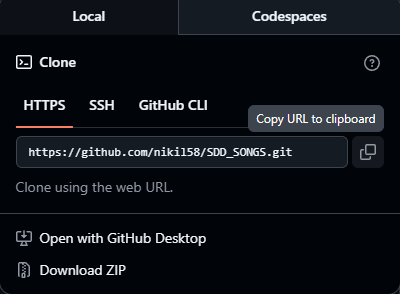
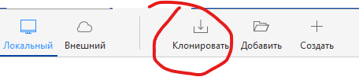
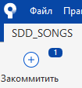
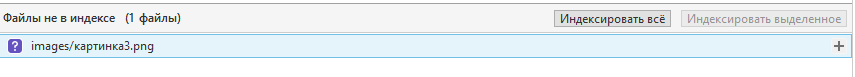
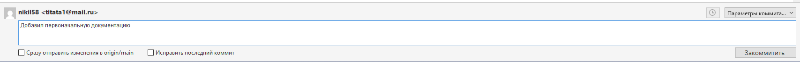
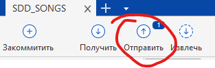

# Проекты "Собаки Для Драки"

Сборник файлов проектов "Собак для Драк" и не только

## Что это такое?

Это -- репозиторий. По сути -- хранилище. Внутри предложена структура. Все, что вам нужно - это добавлять, редактировать, удалять файлы, а потом используя git-команды (для продвинутых) или любой GUI (например, [Sourcetree](https://product-downloads.atlassian.com/software/sourcetree/windows/ga/SourceTreeSetup-3.4.29.exe)) задокументировать (закоммитить) и запушить (отправить) файлы

## Как с этим работать?

В первую очередь качаем [Sourcetree](https://product-downloads.atlassian.com/software/sourcetree/windows/ga/SourceTreeSetup-3.4.29.exe).
Затем, необходимо создать аккаунт на [BitBucket](https://bitbucket.org/product/) (честно, не знаю для чего, но иначе он не дает установить...). Гораздо важнее, создать аккаунт на [GitHub](https://github.com/) (именно тут и находится наш репозиторий)

Создаем аккаунта, дальше клонируем репозиторий по https (можно и по ssh, если вы умнички и настроили это в настройках)

 

Открываем Sourcetree и клонируем все туда. Вставляем ссылку, выбираем место и нажимаем "клонировать"

 

Теперь просто работаем. Когда вы сделали все в своем проекте, все изменения перетащили в нужные папки, то в SourceTree нажимаем "Закоммитить" в левом верхнем углу

 

Дальше по середине будет окно с надписью "файлы не в индексе". Вот там рядом нажимаем на плюсики или "индексировать все"

 

Еще ниже - вводим сообщение о том, что сделали. Краткий пересказ того, что изменили. И справа нажимаем "закоммитить"

 

Теперь ваши изменения готовы для отправки. Нажимаем "Отправить" в верху и радуемся жизни

 

## Я давно не заходил в проект, что делать?

Даже если не "давно", то каждый раз, открывая SourceTree, жмите наверху "получить". Поддерживайте свою локальную копию в синхронизированном состоянии с остальными участниками группы!